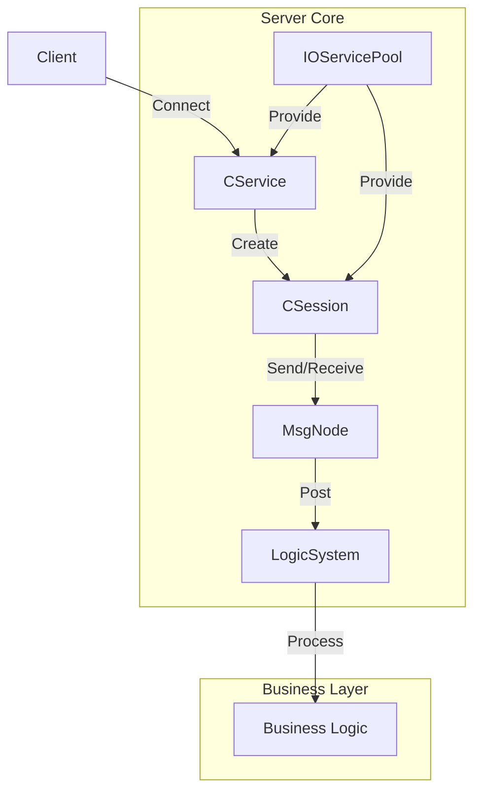

# Asio Coroutine Server

这是一个基于Boost.Asio协程的C++服务器框架，实现了高性能的异步网络通信。

## 项目架构

项目采用模块化设计，主要包含以下几个核心模块：

### 1. 网络服务模块 (CService)

- 负责服务器的启动和监听
- 管理所有客户端会话
- 处理新连接的接受
- 提供会话管理功能（添加/删除会话）

#### 核心函数说明：

- `CService(boost::asio::io_context& ioc, short port)`: 构造函数，初始化服务器
- `ClearSession(const std::string& sessionId)`: 移除指定会话
- `StartAccept()`: 开始监听新连接
- `HandleAccept()`: 处理新连接请求

### 2. 会话管理模块 (CSession)

- 处理单个客户端连接的生命周期
- 实现数据的收发功能
- 维护会话状态
- 提供消息队列管理
- 使用协程实现异步操作

#### 核心函数说明：

- `Start()`: 启动会话，开始接收数据
- `Close()`: 关闭会话
- `Send(const std::string& msg, short msgId)`: 发送字符串消息
- `Send(const char* msg, short len, short msgId)`: 发送二进制消息
- `Receive()`: 开始接收数据
- `HandleSend()`: 处理发送完成回调
- `GetSessionId()`: 获取会话唯一标识

### 3. 消息处理模块 (MsgNode)

- 定义消息节点结构
- 处理消息的序列化和反序列化
- 支持消息头和消息体的分离

#### 核心类说明：

- `SendNode`: 发送消息节点
- `RecvNode`: 接收消息节点
- `LogicNode`: 逻辑处理节点

### 4. 逻辑系统模块 (LogicSystem)

- 单例模式实现
- 处理业务逻辑
- 提供消息回调注册机制
- 异步处理消息队列
- 支持自定义消息处理函数

#### 核心函数说明：

- `GetInstance()`: 获取单例实例
- `PostMsgtToQue()`: 将消息投递到处理队列
- `RegisterMsgCallBack()`: 注册消息处理回调函数
- `DealMsg()`: 处理消息队列中的消息
- `HelloWorld()`: 示例消息处理函数

### 5. IO服务池模块 (IOServicePool)

- 管理IO服务的线程池
- 提供IO服务的分配和回收
- 优化并发性能

#### 核心函数说明：

- `Instance()`: 获取单例实例
- `GetIOService()`: 获取IO服务对象
- `Stop()`: 停止所有IO服务

## 系统架构图



## 数据流向

1. 客户端连接流程：

   ```
   Client -> CService(监听) -> CSession(创建会话) -> IOServicePool(分配IO服务)
   ```
2. 消息处理流程：

   ```
   Client -> CSession(接收) -> MsgNode(解析) -> LogicSystem(处理) -> Business Logic
   ```
3. 消息发送流程：

   ```
   Business Logic -> LogicSystem -> CSession -> Client
   ```

## 主要特性

- 基于Boost.Asio的协程实现
- 异步非阻塞IO
- 线程安全的会话管理
- 灵活的消息处理机制
- 可扩展的业务逻辑系统
- 优雅的服务器关闭处理

## 构建说明

项目使用CMake构建系统，确保已安装以下依赖：

- Boost.Asio
- CMake 3.10+
- C++20兼容的编译器

构建步骤：

```bash
mkdir build
cd build
cmake ..
make
```

## 使用示例

1. 启动服务器：

```cpp
boost::asio::io_context ioc;
CService service(ioc, 12345);
ioc.run();
```

2. 注册消息处理函数：

```cpp
LogicSystem::GetInstance().RegisterMsgCallBack();
```

3. 发送消息：

```cpp
session->Send("Hello World", MSG_ID_HELLO);
```

## 注意事项

- 确保正确处理信号（SIGINT, SIGTERM）以实现优雅关闭
- 注意线程安全，特别是在访问共享资源时
- 合理配置IO服务池的大小以适应服务器负载
- 消息处理函数应该是线程安全的
- 注意内存管理，避免内存泄漏
